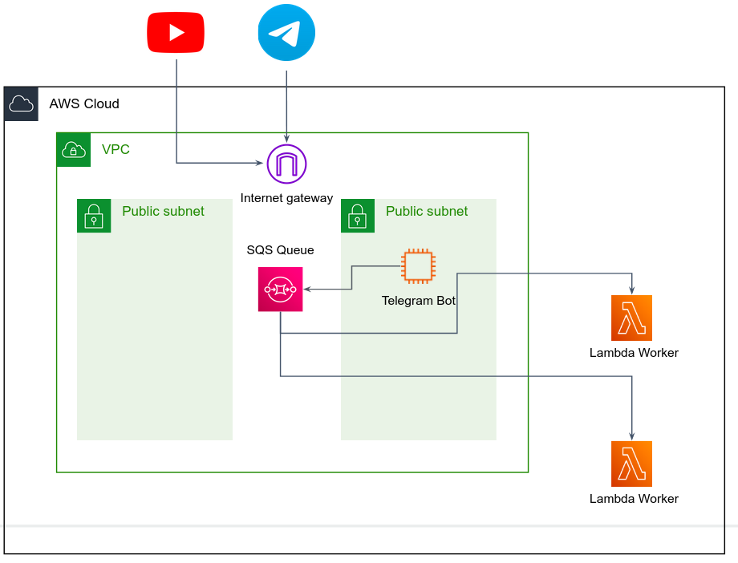

# Lambda Workers triggered by SQS events

We will re-design the YouTube Bot such that Workers are running and scale as Lambda function, triggered by the SQS queue. 

## Create the Lambdas function

1. Open the [Functions page](https://console.aws.amazon.com/lambda/home#/functions) of the Lambda console\.

2. Choose **Create function**\.
3. Choose **Author from scratch**.
4. Under **Basic information**, do the following:

    1. Enter a **Function name**.

    1. For **Runtime**, confirm that **Node\.js 16\.x** is selected\.

5. Choose **Create function**\.

#### Edit the function source code

6. Checkout branch `microservices_lambda` (pull the repo if needed).
7. After selecting your function, choose the **Code** tab\.
8. Copy and paste `worker_lambda.js` code into `index.js` file in the Lambda code editor.
9. Choose **Deploy** to deploy your code.

#### Add SQS as a trigger

9. Under **Configuration** tab, choose **Permissions** and make sure your function role has the needed permissions over SQS.
10. In the function preview window, choose **Add trigger**.
11. Select **SQS** as the source, and fill out the fields.

#### Test the Bot

12. Run the bot locally, and send messages. 
13. Observe the triggered Lambda function.
