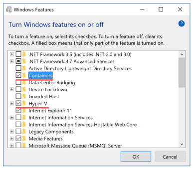

# Docker tutorials

## Get Docker

[Docker Desktop](https://docs.docker.com/desktop/install/windows-install/) is an easy-to-install application for your Mac or Windows environment that enables you to build and share containerized applications and microservices.

**If you installed Docker locally on Windows 10**, make sure the Hyper-V and Containers features are installed and enabled:
1. Right-click the **Windows Start** button and choose **Apps and Features**.
2. Click the **Programs and Features** link (a small link on the right).
3. Click **Turn Windows features on or off**.
4. Check the **Hyper-V** and **Containers** checkboxes and click **OK**.




## Pull and run images

In this tutorial you will run Nginx server in a Docker container and familiarize yourself with the basic commands set of Docker.

1. Pull the [nginx:latest](https://hub.docker.com/_/nginx/) image by:
```shell
docker pull nginx:latest
```

Use `docker images` to see all your containers.

Most of your images will be created on top of a base image from the [Docker Hub](https://hub.docker.com/) registry.
Docker Hub contains many pre-built images that you can `pull` and try without needing to define and configure your own.
To download a particular image, or set of images (i.e., a repository), use `docker pull <image-name>:<image-tag>`.

2. Run it by
```shell
docker run -p 8080:80 --name nginx-1 nginx:latest
```

The `docker run` launches a new container.

3. Execute `docker ps`. How many containers are currently running on your system?

`docker ps` lists containers. Use with `-a` to list all containers (including stopped). It is very useful command to get the status of you running and stopped containers.

4. Stop the running Nginx container by `docker stop <container-name or container-id>`.
5. Start is again by `docker start <name or id>`
6. Kill the running container by `docker kill <name or id>`.

The `docker kill` command kills one or more running containers. Note that kill command doesn't remove the container from your system but only stop it.
In order to clean up the terminated containers use the `docker rm <name or id>` command.


## Containerizing an app

In this tutorial, we will be working with the youtubeBot.
The application source code in under `youtubeBot`.

In order to build the application, we need to use a `Dockerfile`. A Dockerfile is simply a text-based script of instructions that is used to create a container image.

1. Open a terminal and go to the app directory with the `Dockerfile`. Now build the container image using the `docker build` command:
```shell
docker build -t youtube-bot-app:0.0.1 .
```

This command used the Dockerfile to build a new container image.
You might have noticed that a lot of “layers” were downloaded.
This is because we instructed the builder that we wanted to start from the `node:18.6.0-buster-slim` image.
But, since we didn’t have that on our machine, that image needed to be downloaded.

After the image was downloaded, we copied in our application and used `npm` to install our application’s dependencies. The `CMD` directive specifies the default command to run when starting a container from this image.
Finally, the `-t` flag tags our image. Think of this simply as a human-readable name for the final image. Since we named the image `youtube-bot-app:0.0.1`, we can refer to that image when we run a container.

The `.` at the end of the docker build command tells Docker that it should look for the Dockerfile in the current directory.

Now that we have an image, let’s run the application. To do so, we will use the `docker run` command (remember that from earlier?).

3. Start your container by:
```shell
docker run -d -p 8080:3000 youtube-bot-app:0.0.1
```
Note the `-d` which runs the container in background, releasing the CMD terminal.

4. After a few seconds, open your web browser to `http://<instance-ip>:8080`.

## Security scanning (optional)

When you have built an image, it is a good practice to scan it for security vulnerabilities using the `docker scan` command. Docker has partnered with [Snyk](https://snyk.io/) to provide the vulnerability scanning service.

You must be logged in to Docker Hub to scan your images.
Run the command `docker scan --login`, and then scan your images using `docker scan <image-name>`.


## Push docker image to AWS Elastic Container Registry (ECR)

Amazon Elastic Container Registry (Amazon ECR) is an AWS managed Docker container image registry service that is secure, scalable, and reliable.

A **repository** is where you store your Docker images in Amazon ECR\. Each time you push or pull an image from Amazon ECR, you specify the repository and the registry location which informs where to push the image to or where to pull it from\.

1. Open the Amazon ECR console at [https://console\.aws\.amazon\.com/ecr/](https://console.aws.amazon.com/ecr/).

2. Choose **Get Started**\, or **Repositories** and **Create repository**.

3. For **Visibility** settings, choose **Private**.

4. For **Repository name**, specify a name for the repository: `<your-name>-youtube-bot`, while changing `<your-name>` to your name.

6. Choose **Create repository**\.

**Build, tag, and push a Docker image**

1. Select the repository you created and choose **View push commands** to view the steps to push an image to your new repository\.

1. Run the login command that authenticates your Docker client to your registry by using the command from the console in a terminal window\. This command provides an authorization token that is valid for 12 hours\.

1. Build the image and tag it for your new repository\. Using the docker build command from the console in a terminal window\. Make sure that you are in the same directory as your Dockerfile\.

1. Tag the image with your Amazon ECR registry URI and your new repository by pasting the docker tag command from the console into a terminal window\. The console command assumes that your image was built from a Dockerfile in the previous step\. If you did not build your image from a Dockerfile, replace the first instance of `repository:latest` with the image ID or image name of your local image to push\.

1. Push the newly tagged image to your repository by using the docker push command in a terminal window\.

1. Choose **Close**\.
